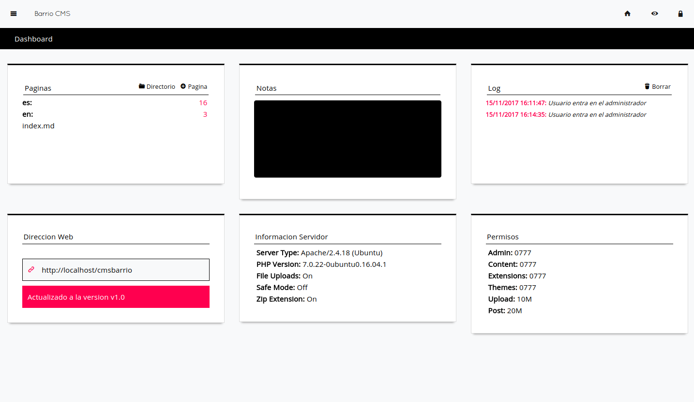
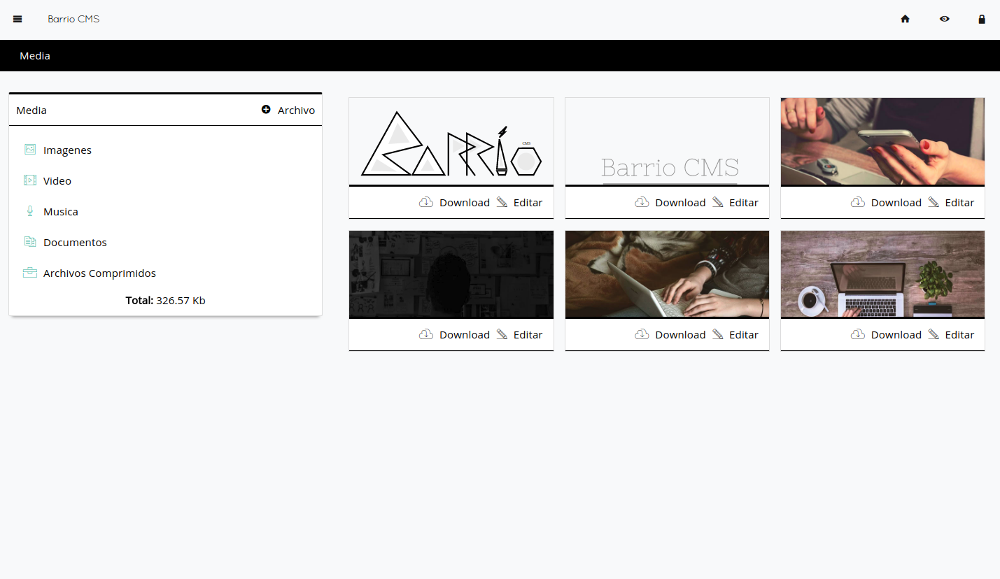

## Vista Previa

### Shortcodes 

### Instalación

Copiar la carpeta admin en el directorio raiz de Barrio cms.

Editar del archivo Config.php

    <?php
        return array(
            'lang' => 'es',
            // protocolo http o https
            'protocol' => 'http',
            // charset
            'charset' => 'UTF-8',
            // timezone
            'timezone' => 'Europe/Brussels',
            // password
            // default is demo123
            'password' => 'e0ec30792753894eb3ed855f5ddccd408a506697'
        );
        

El password por defecto es demo123 puedes crear uno en http://sandbox.onlinephpfunctions.com/

    <?php echo sha1(md5('your password here')); ?>
    

Copias el resultado y lo pegas en password y ya esta.

> Nota:  En algunos hosting necesitas configurar el archivo .htaccess cambiando RewriteBase /admin

    
